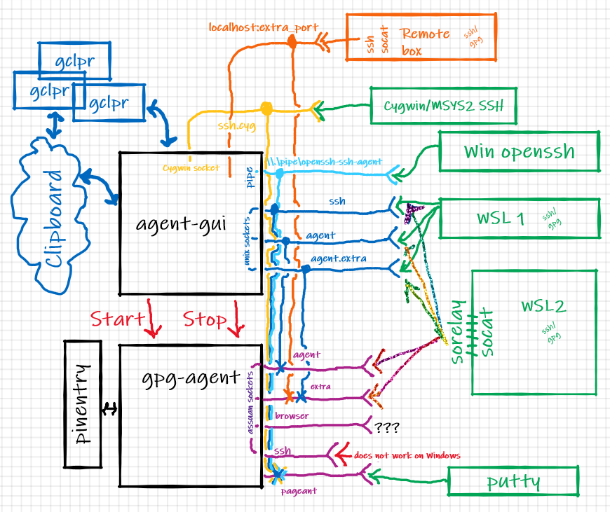
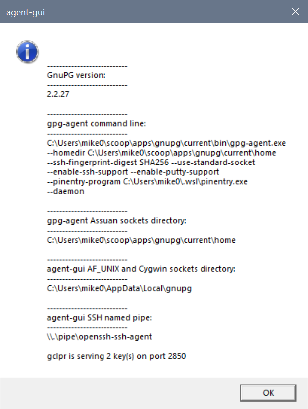
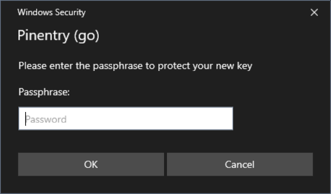
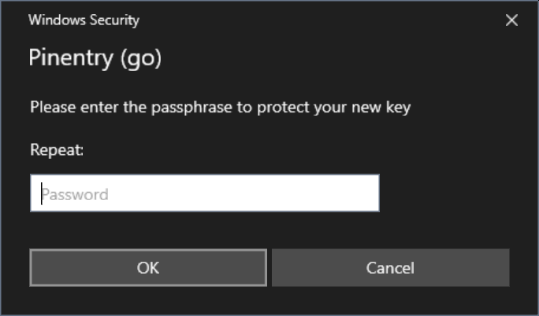
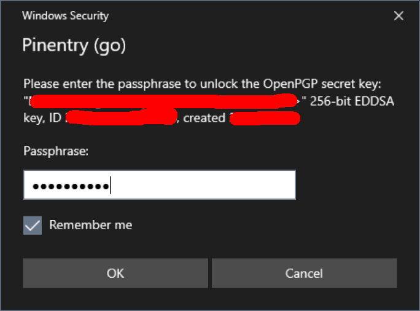

<p align="center">
    <h1 align="center">win-gpg-agent</h1>
    <p align="center">
		Simple set of tools to make working with GPG and SSH keys easier on Windows 10.
    </p>
    <p align="center">
        <a href="https://pkg.go.dev/mod/github.com/rupor-github/win-gpg-agent/?tab=packages"></a>
        <a href="https://goreportcard.com/report/github.com/rupor-github/win-gpg-agent"></a>
    </p>    
    <hr>
</p>

Windows 10 has `ssh-agent` service (with support for persistence and Windows security) and I have been using it [successfully](https:/github.com/rupor-github/wsl-ssh-agent) for a while. However there is another set of tools entirely - [GnuPG](https://gnupg.org/). It implements `ssh-agent` functionality (with somewhat more flexibility than original), supports smart cards, attempts to handle identity aspects of security and sometimes *must* be used (for example to sign git commits on some projects). All of that works [reasonably well](https://eklitzke.org/using-gpg-agent-effectively) on Linux.

Windows usage is a bit more problematic as we have to deal with various non-cooperating pieces: GnuPG win32 binaries are somewhat deficient, OpenSSH port integrated into Windows 10 (console, terminal and all), Cygwin/MSYS2 ssh tools and WSL1 and WSL2 add challenges with specific binaries and different lifetime management requirements. Ideally we need to have Windows host to handle single set of secured keys (SSH and GPG) while transparently providing necessary interfaces to all other environments. This project aims to create simple set of tools to be combined with GnuPG binaries for Windows to do exactly that.

**DISCLAIMER** When using term `GnuPG` I am **not referring** to [GPG4Win](https://gpg4win.org), but rather to basic GnuPG tools built from code base common for all platforms. GPG4Win includes this set (which could be extracted), but normally it is available from GnuPG ftp site [ftp.gnupg.org](https://www.gnupg.org/ftp/gcrypt/binary/). It could be easily installed by using [chocolatey](https://chocolatey.org/) command `choco install gnupg` or [scoop](https://scoop.sh/) command `scoop install gnupg`. So no wonderful KDE GUIs ported to Windows. 

I am still learning the full scope of damage one could cause by using GnuPG tools and I am certainly no expert here.

If you are interested in basic guides on how to handle keys using GnuPG tools - web is full of them and this project has nothing to do with it. [This one](https://insight.o-o.studio/article/setting-up-gpg.html) is very good (albeit somewhat outdated). You could (and probably should) read set of excellent posts by Simon Josefsson: [blog_1](https://blog.josefsson.org/2014/06/23/offline-gnupg-master-key-and-subkeys-on-yubikey-neo-smartcard/) [blog_2](https://blog.josefsson.org/2019/03/21/offline-ed25519-openpgp-key-with-subkeys-on-fst-01g-running-gnuk/) [blog_3](https://blog.josefsson.org/2019/06/21/openpgp-smartcard-under-gnome-on-debian-10-buster/). To put things in perspective and select more practical place for PGP tools overall I strongly suggest studying [this critique](https://latacora.micro.blog/2019/07/16/the-pgp-problem.html). It resonates a lot, especially after spending some time reading GnuPG code.

**NOTE** Eventually many pieces of functionality from this project will become obsolete. I am sure that `gpg-agent` on Windows will directly support Windows OpenSSH server - [T3883](https://dev.gnupg.org/T3883). Microsoft developers will finally decide how they want to handle security on Unix domain sockets and will change [OpenSSH port](https://github.com/PowerShell/openssh-portable.git) and many other wonderful things will happen. Until then we need to create specific translation layers to compensate for deficiencies. Assuan `S.gpg-agent.ssh` support in GnuPG code is presently broken under Windows (at least in GnuPG 2.2.25), so we have to resort to putty/pageant method instead (which today does not work in 64 bits GnuPG builds). And WSL2 requires additional layer of translation (with `socat` on Linux side and either HYPER-V integration service or helper on Windows end) since AF_UNIX interop is not (yet? ever?) implemented for WSL2.

**SECURITY NOTICE:** All the usual security caveats applicable to WSL, SSH and GPG apply here. For example all interaction with the Win32 world happens with the credentials of the user who started the WSL environment. In practice, *if you allow someone else to log in to your WSL environment remotely, they may be able to access the SSH keys stored in
your gpg-agent.* This is a fundamental feature of WSL; if you are not sure of what you're doing, do not allow remote access to your WSL environment (i.e. by starting an SSH server).

**COMPATIBILITY NOTICE:** tools from this project were tested on Windows 10 2004 with multiple distributions and should work on anything starting with 1809 - beginning with insider build 17063 and would not work on older versions of Windows 10, because it requires [AF_UNIX socket support](https://devblogs.microsoft.com/commandline/af_unix-comes-to-windows/) feature. I tested everything with "official" GnuPG Windows builds 2.2.25 and 2.2.26.

## Installation

Starting with v1.2.3 win-gpg-agent can be installed and updated using [scoop](https://scoop.sh/). Thank you [LostLaplace](https://github.com/LostLaplace) and [gpailler](https://github.com/gpailler) for help and inspiration.

Installing:
```
    scoop install https://github.com/rupor-github/win-gpg-agent/releases/latest/download/win-gpg-agent.json
```
and updating:
```
    scoop update win-gpg-agent
``` 

Alternatively download archive from the [releases page](https://github.com/rupor-github/win-gpg-agent/releases) and unpack it in a convenient location.

Starting with v1.2.2 releases are packed with zip and signed with [minisign](https://jedisct1.github.io/minisign/). Here is public key for verification:  RWTNh1aN8DrXq26YRmWO3bPBx4m8jBATGXt4Z96DF4OVSzdCBmoAU+Vq

## Usage

1. Make sure GnuPG works. Create/import keys, setup smart cards, etc.

2. If you are using Windows native ssh-agent - stop it. You may want to delete all keys from its vault - you will need those keys in gpg vault instead.
```
	Stop-Service ssh-agent
	Set-Service -StartupType Disabled ssh-agent
```

3. If you would like to use Cygwin/MSYS2 ssh tools (as is the case by default with [Git4Windows](https://gitforwindows.org/)) you may want to consider placing `gui.openssh: cygwin` in agent-gui.config file. 

**NOTE** that in any case you need to manage `SSH_AUTH_SOCK` environment variable value on Windows side. It has to point to named pipe for Windows OpenSSH to work and to Cygwin socket file for Cygwin/MSYS2 tools and __both sets are using the same variable name__.

4. Run `agent-gui.exe`


Here is a diagram to show simplified relationship between parts: 

Unfortunately due to environment complexity it is difficult to provide simple step-by-step guide. I will try to explain what each piece does (as they could be used separately from each other) and then provide an example setup.

There are presently 3 executables included in the set: `agent-gui.exe`, `pinentry.exe` and `sorelay.exe`

### agent-gui.exe

```
GUI wrapper for gpg-agent

Version:
	1.0.0 (go1.15.6)

Usage: agent-gui.exe [-dh] [-c path]
 -c, --config=path  Configuration file [agent-gui.conf]
 -d, --debug        Turn on debugging
 -h, --help         Show help
```

Is is a simple "notification tray" applet which does `gpg-agent.exe` lifetime management. When started it will
- attempt to locate GnuPG installation and start gpg-agent with "proper" command line parameters.
- make sure that gpg-agent will use `pinentry.exe` from the same directory where agent-gui.exe is.
- make sure that it functions by communicating with it.
- create AF_UNIX socket counterparts for Assuan sockets from gpg-agent (except "browser" and "ssh" ones) and handle translation. I have no use for "browser" and S.gpg-agent.ssh presently does not work on Windows.
- create and service named pipe for Windows native OpenSSH. Note, that OpenSSH (native and Cygwin) and AF_UNIX socket and named pipe are using pageant protocol to talk to gpg-agent.
- create and service Cygwin socket for Cygwin/MSYS2 build of OpenSSH. Note, that OpenSSH (native and Cygwin) and AF_UNIX socket and named pipe are using pageant protocol to talk to gpg-agent.
- set environment variable `SSH_AUTH_SOCK` on Windows side to point either to pipe name so native OpenSSH tools know where to go or to Cygwin socket file to be used with Cygwin/MSYS2 ssh binaries.
- create `WIN_GNUPG_HOME`, `WSL_GNUPG_HOME`, `WIN_AGENT_HOME`, `WSL_AGENT_HOME` environment variables, setting them to point to directories with Assuan sockets and AF_UNIX sockets and register those environment variables with WSLENV for path translation. Basically WSL_* would be paths on the Linux side and WIN_* are Windows ones. This way every WSL environment started after will have proper "unix" and "windows" paths available for easy scripting.
- serve as a backend for [gclpr](https://github.com/rupor-github/gclpr) remote clipboard tool (NOTE: starting with v1.1.0 gclpr server backend enforces protocol versioning and may require upgrade of gclpr).

You could always see what is going on by clicking "Status" on applet's menu:



Reasonable defaults are provided (but could be changed by using configuration file). Full path to configuration file could be provided on command line. If not program will look for `agent-gui.conf` in the same directory where executable is. It is YAML file with following defaults:

```
gpg:
  install_path: "${ProgramFiles(x86)}\\gnupg"
  homedir: "${APPDATA}\\gnupg"
gui:
  debug: false
  setenv: true
  openssh: native
  ignore_session_lock: false
  deadline: 1m
  pipe_name: \\\\.\\pipe\\openssh-ssh-agent
  homedir: "${LOCALAPPDATA}\\gnupg"
  gclpr:
    port: 2850
```

Full list of configuration keys:

* `gpg.install_path` - installation directory of GnuPG suite
* `gpg.homedir` - will be supplied to gpg-agent on start as --homedir
* `gpg.gpg_agent_conf` - if defined will be supplied to gpg-agent on start
* `gpg.gpg_agent_args` - array of additional arguments to be passed to gpg-agent on start. No checking is performed.
* `gui.debug` - turn on debug logging. Uses `OutputDebugStringW` - use Sysinternals [debugview](https://docs.microsoft.com/en-us/sysinternals/downloads/debugview) to see
* `gui.setenv` - automatically prepare environment variables
* `gui.openssh` - when value is `cygwin` set environment `SSH_AUTH_SOCK` on Windows side to point to Cygwin socket file rather then named pipe, so Cygwin and MSYS2 ssh build could be used instead of what comes with Windows 10.
* `gui.ignore_session_lock` - continue to serve requests even if user session is locked
* `gui.pipe_name` - full name of pipe for Windows OpenSSH
* `gui.homedir` - directory to be used by agent-gui to create sockets in
* `gui.deadline` - since code which does translation from Assuan socket to AF_UNIX socket has no understanding of underlying protocol it could leave servicing go-routine handing forever (ex: client process died). This value specifies inactivity deadline after which connection will be collected. 
* `gui.gclpr.port` - server port for [gclpr](https://github.com/rupor-github/gclpr) backend
* `gui.gclpr.line_endings` - line ending translation for [gclpr](https://github.com/rupor-github/gclpr) backend
* `gui.gclpr.public_keys` - array of known public keys for [gclpr](https://github.com/rupor-github/gclpr) backend

### pinentry.exe

```
Pinentry program for GnuPG

        1.0.0 (go1.15.6)

Usage: pinentry.exe [-dh] [-c path] [--version]
 -c, --config=path  Configuration file [C:\Users\mike0\.wsl\pinentry.conf]
 -d, --debug        Turn on debugging
 -h, --help         Show help
     --version      Show version information
```

It is pretty mundane pinentry implementation, I tried to follow everything I could find from GnuPG documentation and pinentry code. Since it is using WIndows Credentials API to show GETPIN dialogs a lot of "visuals" from pinentry protocol are either useless or cannot be easily implemented (timeouts, display settings etc).

I think it could be used as pinentry replacement on Windows even without agent-gui (for example to be called from WSL gpg if you decide to keep your vault there and ignore WIndows GnuPG completely) to show proper GUI dialogs:

 

If you let it - it will save passwords in Windows Credential Manager as "Generic Credentials" providing decent level of convenience and integration:



Configuration file is almost never needed, but just in case full path to configuration file could be provided on command line. If not program will look for `pinentry.conf` in the same directory where executable is. It is YAML file with following defaults:

```
gui:
  debug: false
  pin_dialog:
    delay: 300ms
    name: Windows Security
    class: Credential Dialog Xaml Host
```

* `gui.debug` - turn on debug logging. Uses `OutputDebugStringW` - use Sysinternals [debugview](https://docs.microsoft.com/en-us/sysinternals/downloads/debugview) to see
* `gui.pindialog.*` - since gpg-agent starts pinentry which in turn calls Windows APIs to show various dialogs often due to the timing resulting dialog could be left in the background. Those parameters specify artificial delay and name/class for window to be attempted to be brought into foreground forcefully.

### sorelay.exe

```
Socket relay program for WSL

        1.0.0 (go1.15.6)

Usage: sorelay.exe [-adh] [-c path] [--version] path-to-socket
 -a, --assuan       Open Assuan socket instead of Unix one
 -c, --config=path  Configuration file [C:\Users\mike0\.wsl\sorelay.conf]
 -d, --debug        Turn on debugging
 -h, --help         Show help
     --version      Show version information
```

This is helper program along the lines of John Starks' [npiperelay.exe](https://github.com/jstarks/npiperelay). Put it somewhere on devfs for interop to work its magic and combine with socat on WSL2 side and you could easily convert both Windows Assuan and Windows AF_UNIX sockets into sockets on WSL2 Linux end.

As an example (with proper path) following will translate Windows side Assuan socket:
```
( setsid socat UNIX-LISTEN:/home/rupor/.gnupg/S.gpg-agent,fork EXEC:"${HOME}/winhome/.wsl/sorelay.exe -a c:/Users/mike0/AppData/Roaming/gnupg/S.gpg-agent",nofork & ) >/dev/null 2>&1
```

And this (with proper path) will translate Windows side AF_UNIX socket:
```
( setsid socat UNIX-LISTEN:/home/rupor/.gnupg/S.gpg-agent,fork EXEC:"${HOME}/winhome/.wsl/sorelay.exe c:/Users/mike0/AppData/Local/gnupg/S.gpg-agent",nofork & ) >/dev/null 2>&1
```
You *really* have to be on WSL2 in order for this to work - if you see errors like `Cannot open netlink socket: Protocol not supported` - you probably are under WSL1 and should just use AF_UNIX sockets directly. Run `wsl.exe -l --all -v` to check what is going on. When on WSL2 make sure that socat is installed and sorelay.exe is on windows partition and path is right.

Configuration file is never needed, but just in case full path to configuration file could be provided on command line. If not program will look for `sorelay.conf` in the same directory where executable is. It is YAML file with following defaults:

```
gui:
  debug: false
```

## Example

Putting it all together nicely - `remote` here refers to your wsl shell or some other box or virtual machine you could `ssh` to. Goal here is to have a setup which could be used the same way in different Linux instance with minimal changes and customization - be it native Linux install, something I ssh into or WSL distro running. We should be able to use a small set of safely stored private keys and be able to forward both gpg and ssh everywhere with minimal complexity (at least it should be manageable).

For my WSL installations I always create `~/winhome` and link it to my Windows home directory (where I have `.wsl` directory with various interoperability tools from Windows side). I am assuming that [gclpr](https://github.com/rupor-github/gclpr) is in your path on `remote` and you installed it's Windows counterpart somewhere in `drvfs` location (~/winhome/.wsl is a good place).

I auto-start `agent-gui.exe` on logon on my Windows box - no special customization is needed (except for `gclpr` public keys from various locations I would like to share my clipboard with)

In my .bashrc I detect what I have and where it runs using code like this:

```
    # detect what we have
    if [  $(uname -a | grep -c "Microsoft") -eq 1 ]; then
        export ISWSL=1 # WSL 1
    elif [ $(uname -a | grep -c "microsoft") -eq 1 ]; then
        export ISWSL=2 # WSL 2
    else
        export ISWSL=0
    fi

    if [ ${ISWSL} -eq 1 ]; then
        # WSL 1 could use AF_UNIX sockets from Windows side directly
        if [ -n ${WSL_AGENT_HOME} ]; then
            export GNUPGHOME=${WSL_AGENT_HOME}
            export SSH_AUTH_SOCK=${WSL_AGENT_HOME}/S.gpg-agent.ssh
        fi
    elif [ ${ISWSL} -eq 2 ]; then
        # WSL 2 require socat to create socket on Linux side and sorelay on the Windows side to interop
		if [ ! -d ${HOME}/.gnupg ]; then
			mkdir ${HOME}/.gnupg
			chmod 0700 ${HOME}/.gnupg
		fi
		if [ -n ${WIN_GNUPG_HOME} ]; then
			# setup gpg-agent socket
			_sock_name=${HOME}/.gnupg/S.gpg-agent
			ss -a | grep -q ${_sock_name}
			if [ $? -ne 0  ]; then
				rm -f ${_sock_name}
				( setsid socat UNIX-LISTEN:${_sock_name},fork EXEC:"${HOME}/winhome/.wsl/sorelay.exe -a ${WIN_GNUPG_HOME//\:/\\:}/S.gpg-agent",nofork & ) >/dev/null 2>&1
			fi
			# setup gpg-agent.extra socket
			_sock_name=${HOME}/.gnupg/S.gpg-agent.extra
			ss -a | grep -q ${_sock_name}
			if [ $? -ne 0  ]; then
				rm -f ${_sock_name}
				( setsid socat UNIX-LISTEN:${_sock_name},fork EXEC:"${HOME}/winhome/.wsl/sorelay.exe -a ${WIN_GNUPG_HOME//\:/\\:}/S.gpg-agent.extra",nofork & ) >/dev/null 2>&1
			fi
			unset _sock_name
		fi
		if [ -n ${WIN_AGENT_HOME} ]; then
			# and ssh-agent socket
			export SSH_AUTH_SOCK=${HOME}/.gnupg/S.gpg-agent.ssh
			ss -a | grep -q ${SSH_AUTH_SOCK}
			if [ $? -ne 0  ]; then
				rm -f ${SSH_AUTH_SOCK}
				( setsid socat UNIX-LISTEN:${SSH_AUTH_SOCK},fork EXEC:"${HOME}/winhome/.wsl/sorelay.exe ${WIN_AGENT_HOME//\:/\\:}/S.gpg-agent.ssh",nofork & ) >/dev/null 2>&1
			fi
		fi
    else
        # Do whatever -- this is real Linux
    fi
```

My `.ssh/config` entries used to `ssh` to `remote` have port forwarding enabled for `gclpr`:
```
RemoteForward 2850 127.0.0.1:2850
```

On `remote` my `tmux.conf` includes following lines:
```
# --- clipboard -------------------------------------------------------------------
set -g set-clipboard off
if-shell 'if [ -n ${WSL_DISTRO_NAME} ]; then true; else false; fi' \
  'bind-key -T copy-mode-vi Enter send-keys -X copy-pipe-and-cancel "~/winhome/.wsl/gclpr.exe copy" ; bind-key -T copy-mode-vi MouseDragEnd1Pane send-keys -X copy-pipe-and-cancel "~/winhome/.wsl/gclpr.exe copy"' \
  'bind-key -T copy-mode-vi Enter send-keys -X copy-pipe-and-cancel "gclpr copy" ; bind-key -T copy-mode-vi MouseDragEnd1Pane send-keys -X copy-pipe-and-cancel "gclpr copy"'
```

And my `neovim` configuration file `init.vim` on `remote` has following lines:
```
set clipboard+=unnamedplus
if has("unix")
	" ----- on UNIX ask lemonade to translate line-endings
	if empty($WSL_DISTRO_NAME)
		if executable('gclpr')
			let g:clipboard = {
				\   'name': 'gclpr',
				\   'copy': {
				\      '+': 'gclpr copy',
				\      '*': 'gclpr copy',
				\    },
				\   'paste': {
				\      '+': 'gclpr paste --line-ending lf',
				\      '*': 'gclpr paste --line-ending lf',
				\   },
				\   'cache_enabled': 0,
				\ }
		endif
	else
		" ---- we are inside WSL - reach out to the Windows side
		if executable($HOME . '/winhome/.wsl/gclpr.exe')
			let g:clipboard = {
				\   'name': 'gclpr',
				\   'copy': {
				\      '+': $HOME . '/winhome/.wsl/gclpr.exe copy',
				\      '*': $HOME . '/winhome/.wsl/gclpr.exe copy',
				\    },
				\   'paste': {
				\      '+': $HOME . '/winhome/.wsl/gclpr.exe paste --line-ending lf',
				\      '*': $HOME . '/winhome/.wsl/gclpr.exe paste --line-ending lf',
				\   },
				\   'cache_enabled': 0,
				\ }
		endif
	endif
endif
```

Using SSH and Linux you could remote GnuPG extra socket as far as you want by adding something like this to you `.ssh/config` where you want it:
```
RemoteForward /home/rupor/.gnupg/S.gpg-agent /home/rupor/.gnupg/S.gpg-agent.extra
```

Just follow [this guide](https://gist.github.com/TimJDFletcher/85fafd023c81aabfad57454111c1564d) - it will allow you to sign you git commits everywhere using single private key while keeping it in a single safe place (like smart card). You will still have to distribute and import public key in multiple places, which may be inconvenient but should be secure. You could [read a bit more](https://www.gnupg.org/gph/en/manual/x56.html#:~:text=To%20send%20your%20public%20key,identify%20the%20key%20to%20export.) on that.

## Credits

* Thanks to [Ben Pye](https://github.com/benpye) with his [wsl-ssh-pageant](https://github.com/benpye/wsl-ssh-pageant) for inspiration.
* Thanks to [Masataka Pocke Kuwabara](https://github.com/pocke) for [lemonade](https://github.com/lemonade-command/lemonade) - a remote utility tool. (copy, paste and open browser) over TCP.
* Thanks to [John Starks](https://github.com/jstarks) for [npiperelay](https://github.com/jstarks/npiperelay) - access to Windows pipes from WSL.
* Thanks to [Max Mazurov](https://github.com/foxcpp) for [go-assuan](https://github.com/foxcpp/go-assuan)
* Thanks to [Daniel Joos](https://github.com/danieljoos) for [wincred](https://github.com/danieljoos/wincred)

Icons used are downloaded from [Icon Archive](https://iconarchive.com/), they all allow non commercial free use and are copyrighted by authors.
